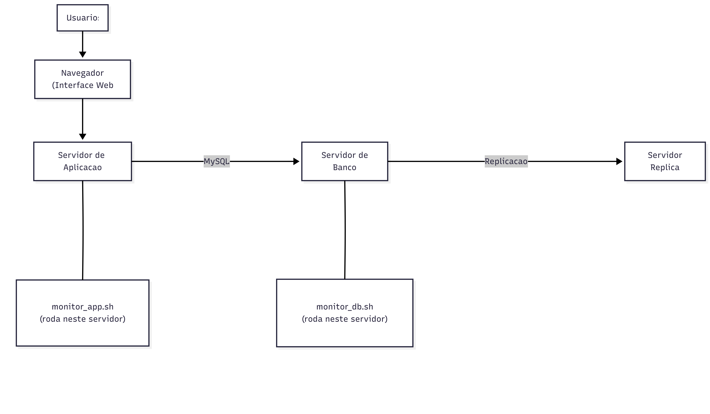

# Monitoramento de Fila PHP e Slow Queries — GLPI

Scripts bash para monitoramento em tempo real da infraestrutura GLPI, permitindo identificar problemas de lentidao na fila de processos PHP-FPM e queries lentas no MySQL.

## Arquitetura



Cada script deve rodar **localmente** no respectivo servidor, pois acessa recursos locais (PHP-FPM status via `127.0.0.1`, MySQL via `~/.my.cnf`).

> **Nota:** O servidor de replica e **opcional**. Ele pode ser utilizado, por exemplo, para gerar relatorios em ferramentas de BI sem impactar o banco de producao. A secao de replicacao no `monitor_db.sh` so exibe dados se a replicacao estiver configurada.

## Estrutura do Repositorio

```
├── README.md                              # Esta documentacao
├── .gitignore                             # Ignora logs e credenciais
├── scripts/
│   ├── monitor_app.sh                     # Monitoramento PHP-FPM e sessoes
│   └── monitor_db.sh                      # Monitoramento MySQL e replicacao
├── config/
│   ├── exemplo-my.cnf                     # Exemplo de credenciais MySQL
│   └── exemplo-php-fpm-status.conf        # Exemplo de config do status PHP-FPM
└── docs/
    └── arquitetura.png                    # Diagrama de arquitetura
```

---

## Inicio Rapido

```bash
# 1. Clone o repositorio
git clone <url-do-repositorio>
cd Monitoramento-Fila-PHP-Slow-Query

# 2. Copie o script para o servidor apropriado
# No servidor de aplicacao (PHP-FPM):
cp scripts/monitor_app.sh /usr/local/bin/
chmod +x /usr/local/bin/monitor_app.sh

# No servidor de banco de dados (MySQL):
cp scripts/monitor_db.sh /usr/local/bin/
chmod +x /usr/local/bin/monitor_db.sh

# 3. Configure os pre-requisitos (veja secoes abaixo)

# 4. Execute
monitor_app.sh    # no servidor de aplicacao
monitor_db.sh     # no servidor de banco
```


---

## Pre-requisitos e Instalacao

### Pacotes Necessarios

**Servidor de Aplicacao (monitor_app.sh):**

```bash
# Debian/Ubuntu
apt install -y curl coreutils findutils procps

# RHEL/CentOS/Rocky/Fedora
dnf install -y curl coreutils findutils procps-ng

# SUSE/openSUSE
zypper install -y curl coreutils findutils procps
```

| Pacote | Para que serve |
|---|---|
| `curl` | Acessar a pagina de status do PHP-FPM via HTTP |
| `coreutils` | Comandos basicos (`du`, `cut`, `date`, `sort`, `head`) usados para calcular tamanho de logs e formatar saida |
| `findutils` | Comando `find`, usado para buscar sessoes PHP por idade no disco |
| `procps` / `procps-ng` | Comando `watch`, usado para atualizar a tela do monitor periodicamente |

**Servidor de Banco de Dados (monitor_db.sh):**

```bash
# Debian/Ubuntu
apt install -y mysql-client coreutils procps

# RHEL/CentOS/Rocky/Fedora
dnf install -y mysql coreutils procps-ng

# SUSE/openSUSE
zypper install -y mysql-client coreutils procps
```

| Pacote | Para que serve |
|---|---|
| `mysql-client` / `mysql` | Cliente MySQL para executar as queries de monitoramento |
| `coreutils` | Comandos basicos (`du`, `cut`, `date`, `sort`, `head`) usados para calcular tamanho de logs e formatar saida |
| `procps` / `procps-ng` | Comando `watch`, usado para atualizar a tela do monitor periodicamente |

### Configuracao do PHP-FPM Status Page

O `monitor_app.sh` precisa acessar a pagina de status do PHP-FPM. Para habilitar:

1. Edite o arquivo de configuracao do pool PHP-FPM:
   - **Debian/Ubuntu:** `/etc/php/<versao>/fpm/pool.d/www.conf`
   - **RHEL/CentOS/Rocky:** `/etc/php-fpm.d/www.conf`

2. Adicione ou descomente:
   ```ini
   pm.status_path = /status
   ```

3. Se o PHP-FPM escuta via socket Unix, configure o web server para expor o endpoint ou use escuta dedicada:
   ```ini
   pm.status_listen = 127.0.0.1:8000
   ```

4. Reinicie o PHP-FPM:
   ```bash
   systemctl restart php-fpm
   ```

5. Teste o acesso:
   ```bash
   curl http://127.0.0.1:8000/status
   curl http://127.0.0.1:8000/status?full
   ```

> Veja o arquivo `config/exemplo-php-fpm-status.conf` para um exemplo completo com instrucoes detalhadas, incluindo configuracao Nginx.

**Importante:** Ajuste a variavel `FPM_STATUS` no topo do `monitor_app.sh` se a URL do status for diferente de `http://127.0.0.1:8000/status`.

---

## Configuracao de Acesso ao Banco de Dados

O `monitor_db.sh` usa o cliente `mysql` que le credenciais automaticamente de `~/.my.cnf`.

### 1. Criar usuario MySQL para monitoramento

Conecte no MySQL como root e execute:

```sql
CREATE USER 'monitor_glpi'@'localhost' IDENTIFIED BY 'SUA_SENHA_SEGURA';

GRANT PROCESS, REPLICATION CLIENT ON *.* TO 'monitor_glpi'@'localhost';
GRANT SELECT ON information_schema.* TO 'monitor_glpi'@'localhost';
GRANT SELECT ON performance_schema.* TO 'monitor_glpi'@'localhost';

FLUSH PRIVILEGES;
```

**Privilegios necessarios:**
| Privilegio | Uso |
|---|---|
| `PROCESS` | Visualizar processlist (queries ativas e lentas) |
| `REPLICATION CLIENT` | Verificar status de replicacao (`SHOW MASTER STATUS`) |
| `SELECT` em `information_schema` | Consultar locks InnoDB e status global |
| `SELECT` em `performance_schema` | Metricas adicionais de performance |

### 2. Configurar ~/.my.cnf

```bash
# Copie o exemplo
cp config/exemplo-my.cnf ~/.my.cnf

# Edite com suas credenciais
vi ~/.my.cnf
```

Conteudo do arquivo:
```ini
[client]
user=monitor_glpi
password=SUA_SENHA_SEGURA
```

### 3. Proteger o arquivo (OBRIGATORIO)

```bash
chmod 600 ~/.my.cnf
```

### 4. Testar a conexao

```bash
mysql -e "SELECT 1;"
mysql -e "SHOW GLOBAL STATUS LIMIT 1;"
```

### Aviso de Seguranca sobre o ~/.my.cnf

> **Recomendacao:** Mantenha a senha no `~/.my.cnf` **apenas durante testes e validacao**. Apos confirmar que o monitoramento esta funcionando, **comente ou remova a linha `password`** do arquivo para evitar que credenciais fiquem expostas em disco.
>
> Com a senha removida do `~/.my.cnf`, o cliente `mysql` solicitara a senha interativamente a cada execucao do script. Basta manter apenas o usuario:
>
> ```ini
> [client]
> user=monitor_glpi
> # password=SUA_SENHA_SEGURA    ← comentado por seguranca
> ```
>
> Ao executar o `monitor_db.sh`, o MySQL pedira a senha no terminal. Esta e a opcao mais segura para ambientes de producao.

---

## Configuracao dos Logs

Ambos os scripts geram logs automaticamente. Crie os arquivos de log com permissoes adequadas:

**No servidor de aplicacao:**
```bash
touch /var/log/glpi_monitor_app.log
chmod 644 /var/log/glpi_monitor_app.log
```

**No servidor de banco:**
```bash
touch /var/log/glpi_monitor_db.log
chmod 644 /var/log/glpi_monitor_db.log
```

Os logs possuem **rotacao automatica**: quando atingem 50MB, o arquivo atual e renomeado com timestamp (`.bak`) e um novo e criado. O tamanho maximo pode ser ajustado pela variavel `LOG_MAX_MB` no topo de cada script.

**Formato do log:**
```
[28/03/2026 07:30:19] [INFO] FPM: total=36 active=1 idle=35 queue=0 accepted=3773
[28/03/2026 07:30:19] [WARN] FPM slow_requests=5
[28/03/2026 07:30:19] [ERROR] Sem acesso ao MySQL
```


Niveis: `INFO` (informativo), `WARN` (alerta que requer atencao), `ERROR` (falha critica).

---

## Como Executar

### monitor_app.sh (Servidor de Aplicacao)

```bash
# Executar diretamente
bash monitor_app.sh

# Ou torne executavel e rode
chmod +x monitor_app.sh
./monitor_app.sh
```

O script usa `watch -n 2` internamente, atualizando a tela a cada 2 segundos. Pressione `Ctrl+C` para sair.

### monitor_db.sh (Servidor de Banco)

```bash
# Executar diretamente
bash monitor_db.sh

# Ou torne executavel e rode
chmod +x monitor_db.sh
./monitor_db.sh
```

Tambem atualiza a cada 2 segundos via `watch`. Pressione `Ctrl+C` para sair.

### Variaveis Configuraveis

Ambos os scripts possuem variaveis no topo que podem ser ajustadas:

| Variavel | Script | Padrao | Descricao |
|---|---|---|---|
| `FPM_STATUS` | monitor_app.sh | `http://127.0.0.1:8000/status` | URL da pagina de status PHP-FPM |
| `SESSION_DIR` | monitor_app.sh | `/var/lib/php/session` | Diretorio de sessoes PHP |
| `INTERVAL` | ambos | `2` | Intervalo de atualizacao (segundos) |
| `LOG_FILE` | monitor_app.sh | `/var/log/glpi_monitor_app.log` | Caminho do log |
| `LOG_FILE` | monitor_db.sh | `/var/log/glpi_monitor_db.log` | Caminho do log |
| `LOG_MAX_MB` | ambos | `50` | Tamanho maximo do log antes da rotacao |

---

## O que Cada Script Monitora

### monitor_app.sh

| Secao | O que mostra | Por que importa |
|---|---|---|
| **PHP-FPM Pool Status** | Total de processos, ativos, ociosos, fila de espera, slow requests, uptime | Identifica saturacao do pool e requisicoes represadas |
| **PHP-FPM Processos Ativos** | PIDs em estado "Running" com URI, duracao, CPU e memoria | Detecta processos travados ou lentos em tempo real |
| **Top 5 Requisicoes por CPU** | As 5 ultimas requisicoes que mais consumiram CPU | Identifica endpoints problematicos do GLPI |
| **PHP Sessions em Disco** | Total de sessoes, novas, ociosas e tamanho total | Acumulo de sessoes pode causar lentidao no filesystem |

### monitor_db.sh

| Secao | O que mostra | Por que importa |
|---|---|---|
| **Queries em Execucao** | Todas as queries ativas (exceto Sleep e event_scheduler) | Visao geral da carga no banco |
| **Queries Lentas (>2s)** | Queries rodando ha mais de 2 segundos | Identifica queries que precisam de otimizacao |
| **InnoDB Locks** | Transacoes em espera e transacoes bloqueadoras | Locks podem causar travamento em cascata |
| **Status Global MySQL** | Threads, slow queries acumuladas, buffer pool hit rate, DML counters | Metricas gerais de saude do banco |
| **Replicacao (opcional)** | Arquivo binlog, posicao e GTID | Verifica se a replicacao esta ativa e progredindo. So exibe dados se a replicacao estiver configurada (ex: replica para BI/relatorios) |

---

## Interpretacao da Saida

### Codigo de Cores

| Cor | Significado |
|---|---|
| Verde | Normal / saudavel |
| Amarelo | Atencao / alerta — investigar se persistir |
| Vermelho | Critico — acao necessaria |
| Branco | Informativo / valor neutro |
| Ciano | Titulos de secao |

### Limiares de Alerta — monitor_app.sh

| Metrica | Amarelo | Vermelho | Acao recomendada |
|---|---|---|---|
| Processos ativos | > 5 | > 10 | Verificar endpoints lentos, considerar aumentar `pm.max_children` |
| Listen queue | — | > 0 | Pool saturado, requisicoes esperando. Aumentar workers ou otimizar codigo |
| Max children reached | > 0 | — | Pool atingiu o limite. Avaliar aumento de `pm.max_children` |
| Sessoes em disco | > 50 | > 200 | Configurar limpeza de sessoes ou migrar para Redis |
| Processo rodando > 5s | — | Log WARN | Investigar a URI indicada no log |

### Limiares de Alerta — monitor_db.sh

| Metrica | Amarelo | Vermelho | Acao recomendada |
|---|---|---|---|
| Threads running | — | > 10 | Muitas queries simultaneas, verificar carga |
| Slow queries acumuladas | > 1.000 | > 50.000 | Habilitar slow query log do MySQL e otimizar |
| Row lock waits | — | > 0 | Contencao de locks, investigar transacoes longas |
| Buffer pool hit rate | — | < 95% | Aumentar `innodb_buffer_pool_size` |
| Query rodando > 2s | — | Log WARN | Analisar e otimizar a query indicada |

---

## Slow Query Log do MySQL (Opcional)

Os scripts **nao dependem** do slow query log para funcionar — o `monitor_db.sh` detecta queries lentas em tempo real consultando a `information_schema.processlist` diretamente.

Porem, o slow query log do MySQL e **complementar**: ele grava um historico persistente de todas as queries que excederam um tempo definido, permitindo analise posterior detalhada.

### Quando habilitar

- Quando voce precisa de um **historico** das queries lentas para analisar depois (o monitor mostra apenas o momento atual)
- Para identificar queries lentas que acontecem de madrugada ou fora do horario de monitoramento
- Para compartilhar evidencias com a equipe de desenvolvimento/DBA

### Como habilitar temporariamente (sem reiniciar)

```sql
-- Habilitar o slow query log
SET GLOBAL slow_query_log = 'ON';

-- Definir o limiar: queries acima de 2 segundos serao logadas
SET GLOBAL long_query_time = 2;

-- Definir o arquivo de saida
SET GLOBAL slow_query_log_file = '/var/log/mysql/slow-query.log';
```

### Como tornar persistente (sobrevive a reinicio do MySQL)

Adicione ao arquivo de configuracao do MySQL (`/etc/my.cnf` ou `/etc/mysql/mysql.conf.d/mysqld.cnf`):

```ini
[mysqld]
slow_query_log = 1
long_query_time = 2
slow_query_log_file = /var/log/mysql/slow-query.log
```

Reinicie o MySQL:
```bash
systemctl restart mysqld    # RHEL/CentOS
systemctl restart mysql     # Debian/Ubuntu
```

### Verificar se esta ativo

```sql
SHOW VARIABLES LIKE 'slow_query%';
SHOW VARIABLES LIKE 'long_query_time';
```

### Analisar o log

O MySQL inclui a ferramenta `mysqldumpslow` para sumarizar o slow query log:

```bash
# Top 10 queries mais lentas
mysqldumpslow -s t -t 10 /var/log/mysql/slow-query.log

# Top 10 queries mais frequentes
mysqldumpslow -s c -t 10 /var/log/mysql/slow-query.log
```

> **Atencao:** Em ambientes com alta carga, o slow query log pode crescer rapidamente. Monitore o tamanho do arquivo e considere desabilitar apos a analise.

---

## Troubleshooting

### monitor_app.sh

**"PHP-FPM status inacessivel"**
- Verifique se `pm.status_path = /status` esta configurado no pool PHP-FPM
- Verifique se o PHP-FPM esta rodando: `systemctl status php-fpm`
- Teste manualmente: `curl http://127.0.0.1:8000/status`
- Ajuste a variavel `FPM_STATUS` no script se a porta/URL for diferente

**Sessoes mostrando 0**
- Verifique se o diretorio de sessoes esta correto: `ls /var/lib/php/session`
- O diretorio pode variar por distribuicao. Ajuste `SESSION_DIR` no script
- Verifique permissao de leitura no diretorio

### monitor_db.sh

**"Sem acesso ao MySQL"**
- Verifique se `~/.my.cnf` existe e tem as credenciais corretas
- Verifique permissoes: `ls -la ~/.my.cnf` (deve ser `600`)
- Teste a conexao: `mysql -e "SELECT 1;"`
- Verifique se o MySQL esta rodando: `systemctl status mysqld` ou `systemctl status mysql`

**"Sem dados de replicacao"**
- Ocorre quando o servidor nao e Primary ou replicacao nao esta configurada
- Se for Primary, verifique: `mysql -e "SHOW MASTER STATUS;"`
- Se for Replica, o script mostra Master Status (adapte para `SHOW REPLICA STATUS` se necessario)

**Locks nao aparecem**
- Em versoes mais novas do MySQL (8.0+), as tabelas de lock mudaram
- A view `information_schema.innodb_lock_waits` pode nao existir
- Para MySQL 8.0+, considere usar `performance_schema.data_lock_waits`

### Geral

**"watch: command not found"**
- Instale o pacote `procps` ou `procps-ng` conforme sua distribuicao (veja secao de Pre-requisitos)

**Log nao e criado**
- Verifique permissao de escrita no diretorio `/var/log/`
- Crie o arquivo manualmente: `touch /var/log/glpi_monitor_app.log`
- Se nao tiver acesso a `/var/log/`, altere `LOG_FILE` para outro caminho
